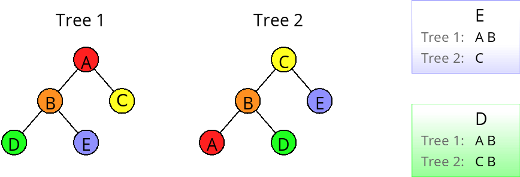
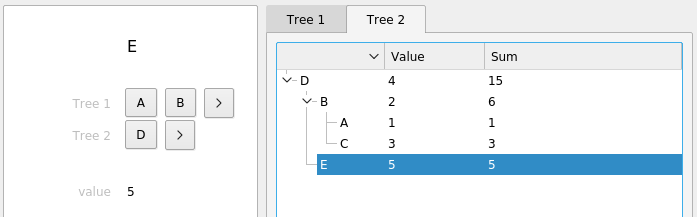
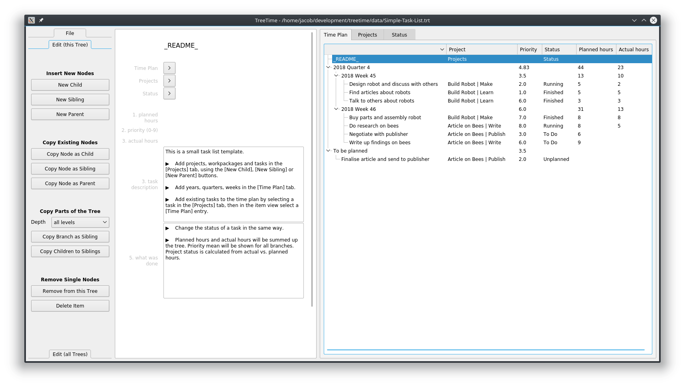
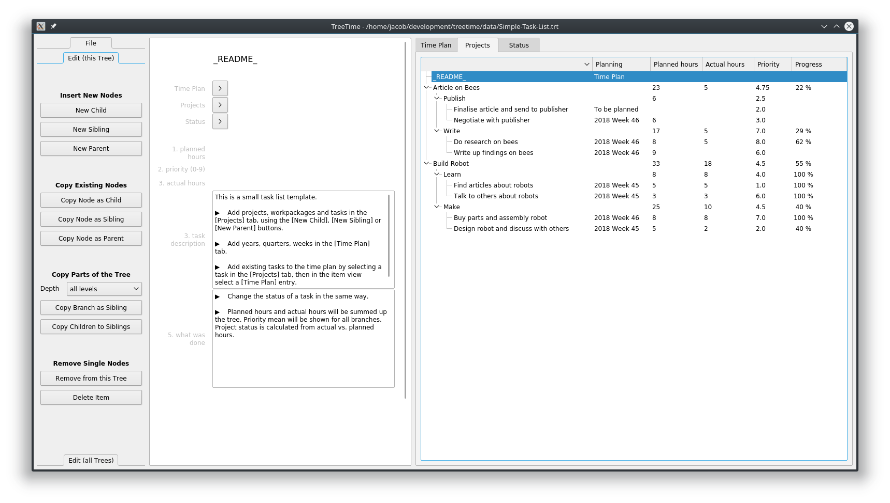
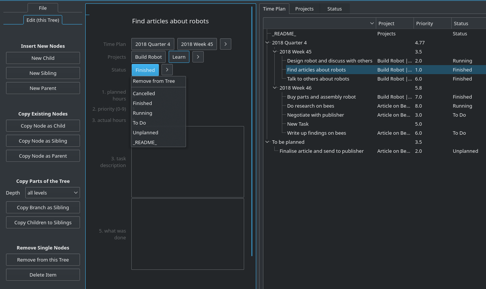

#  &nbsp; &nbsp; &nbsp; &nbsp;TreeTime

Note: If your looking for the phylogenetics software of the same name, you can find it here: [github.com/neherlab/treetime](https://github.com/neherlab/treetime).

_TreeTime_ is a general data organisation, management and analysis tool using linked trees instead of flat lists of tables. A tree is a hierarchical structure that arranges your data into units and sub-units. Mathematical functions (sum, difference, mean, ratio) can be calculated recursively. Linked trees are distinct trees that share data between them. In _TreeTime_, a data object is part of several trees at the same time. _TreeTime_ is a time planner, a to-do list manager, a test report tool, a project planner, a family ancestry editor, a mind-mapping tool, and similar.

### Table of Contents  ###

- [Concept](#id-concept)
- [Basic Use](#id-usage)
- [Data Files](#id-file-syntax)
- [Installation](#id-installation)
- [Road-Map](#id-roadmap)
- [Dependencies](#id-dependencies)

## Concept ##
[Table of Contents](#id-contents)

### What is a Tree? ###

A "tree" is a data structure, much like a table or a list. Using a tree you can naturally package your information into boxes and sub-boxes and sub-sub-boxes. Some examples:  

If you want to organise your work tasks you could sort them into work packages, that are part of projects, that are part of products. Alternatively, if you plan a larger project, you can sort all tasks by responsible persons, who are part of teams, that are part of departments, that are part of branches. You can also make a time plan, where a year consists of quarters, that consist of weeks, that contain a number of tasks. You can have an address book where you have a hierarchy of friends / colleagues / aquaintances, or you can sort knowledge about animals into kingdom / class / family / species.  
  
The nice thing about trees is that you can define mathematical functions on them. Planned hours can be summed up per work package and project, or per person and team, or per week and month. A mean priority can be shown per work package and project.  
  
The concept of hierarchical categorisation can be applied to all sorts of data and will feel a lot more natural and easier to use than organising the same data in spread sheets.  

### What are linked Trees? ### 

The core concept of _TreeTime_ are linked trees. Linked trees are separate trees that share the same data. One piece of data (a _node_) can be in several trees at the same time, but in different place of the tree. A tree is much like a way of sorting, and linked trees sort the same data in different ways.  
  
Node _E_ is right at the bottom of _Tree 1_, as a child of _A_ and _B_, and in _Tree 2_ it is a child of _D_. In _TreeTime_ any kind of number or text can be stored in a node. In this example, let us have a field we call "value" in the node items and use A=1, B=2, etc; and a field we call "Sum" that sums up the current value, and the values of all children. In _TreeTime_, looking at item _E_ and _Tree 1_ this looks like this:  
  
Clicking on the other tab shows the second tree while the same items stays selected:  
  
Note how the values are summed up the branches. Apart from sums, _TreeTime_ also offers means, ratios, or differences, using different combinations of parent, child, or sibling fields.  
  
Linked trees are a natural and powerful way to structure data. If you, for instance, organise information about animals, you might want to see the animal's taxonomy (kingdom/class/family/species), but also their habitat (continent/country/area), and switch between both views. If you organise tasks, you could switch between a year/quarter/week/day breakdown, a company/department/team/person tree, and a product/project/package/task overview.  
  
In _TreeTime_, the structure of your data (whether you store priority, hours, and a description for a task, or expected life span, habitat and number of legs for an animal), the trees themselves, and the calculated values within the trees are completely user defined. Data is stored in text files, changes are saved on the fly, and when opening _TreeTime_, the software is automatically connected to the last used file.  
  

##  Basic Use  ##
[Table of Contents](#id-contents)

Start the software (see 'Execute' from the section [Installation](#id-installation)). In the main dialog, go to "File" / "New from Template", select "Simple-Task-List.trt" and in the next dialog give a file name for the new file. An example file with a simple project task list structure will open.  
  
The GUI consists of three parts:  
- A button box on the left. Execute tree structure operations from here.
- An editing grid in the middle, showing the contents of the selected data item. Edit single data items here.
- A tab view with tress spanning the center-right. View and analyse your data here.
  
  
Access each single tree by clicking a tab on the main tree-view widget (the picture above shows the tree _Time Plan_, the picture below the tree _Projects_).  
  
Branches and children can be sorted, branches can be folded and unfolded. Data content is shown via analytic fields that are defined per tree. In the example project you will see a sum, a percentage, and text display.  
  
Add, move and remove single nodes and complete branches by using the buttons on the left. Change the name of a node by selecting the node and editing the name in the top of the edit grid in the middle. Change all other values (numbers or text) by clicking into the field and start typing.  
  
The parents of an item are listed underneath the item name. Each tree has a separate line. Change the position of a node within a tree by clicking on any of the parent buttons.  
  
In this example a new node in the tree _Time Plan_ has just been created, and is now added to the tree _Projects_.  
  
_TreeTime_ lets you select different themes and will try to use the default colours that are defined with your operating system.  
  
  

<dif id='id-file-syntax'/>

## Data Files ##

_TreeTime_'s data is stored in ._trt_ files. These are plain editable text files. Please have a look at the file _Simple-Task-List.trt_ to understand the syntax. A detailed description will follow later. (Sorry...)

##  Installation  ##
[Table of Contents](#id-installation)

### Using pre-compiled Binaries ###

- Windows, Linux: Go to [github.com/jkanev/treetime/releases/tag/2018-10](https://github.com/jkanev/treetime/releases/tag/2018-10) and download a zipped package for Windows 10, 64 bit, or for Linux 64 bit from there. Unzip it into your program directory and run _TreeTime_ or _TreeTime.exe_ from the new folder. Unzip the data package too. Add the program folder to your path.  
  
  Executable bundles have been created with pyinstaller ([www.pyinstaller.org](http://www.pyinstaller.org)).

- Mac: Mac users please use the Python code (see below). There is no executable for Mac.
(If anybody can help building an executable for other platforms I'd be delighted.)

### Using a PyPi package in Python ###

1. If you don't have it yet, install python3
2. Install PyQt5 -- on an elevated command prompt (Windows), or on the standard command line (Mac, Linux), type:  
    `pip install pyqt5`
3. Install _TreeTime_ -- on an elevated command prompt (Windows), or on the standard command line (Mac, Linux), type:
    `pip install treetime`

### Using script code with Python ###

1. If you don't have it yet, install python3
2. Install PyQt5 -- on an elevated command prompt (Windows), or on the standard command line (Mac, Linux), type: `pip install pyqt5`
3. Download this project from GitHub as a zip file (https://github.com/jkanev/treetime/archive/master.zip) and unzip
4. Install _TreeTime_: in the command line, cd into the main directory, then type:
   - Linux:  
       `python3 setup.py build`  
       `sudo python3 setup.py install`  
   - Windows:  
       `py setup.py build`  
       `py setup.py install`  

### Execute ###

- Windows: Hit the Windows key and type "TreeTime", then click the "run command treetime" that comes up.
- Linux, Mac: On the command line, type "TreeTime". You can also start this any other way your operating system supports. Plus, there's a .desktop file (for KDE and Gnome) in the data directory to create desktop or menu link.

##  Road-Map  ##
[Table of Contents](#id-contents)

I deliberately didn't give any time estimates for this. I'm using the software myself to organise my own data, so I'm interested in keeping this going. Nevertheless I cannot promise any specific release dates. If you have any suggestions or would like me to implement some feature sooner than I suggested here, please just drop me an email.

Past
- Done February 2016: Implemented selection (the same item gets selected in all trees, changing a tab shows the same item)
- Done March 2016: Implemented remaining local functionality (Copy Branch as Sibling, Copy Children to Siblings, Remove from this Tree, Delete Item)
- Done August 2016: Created installable python package
- Done May 2017: Implemented new field type _text_
- Done June 2017: Create deployable packages for Linux and Windows
- Done June 2017: Made pre-release v0.0 available
- Done October 2017: Implemented new field type _node-path_, re-wrote the way nodes move to new parents
- Done November 2017: Uploaded package to pypi.python.org, _TreeTime_ can now be installed using pip
- Done October 2018: Re-implemented the parent selection mechanism. The old cascaded menus have been replaced with single drop down lists.
- Done October 2018: Re-furbished the GUI and removed a couple of bugs. Slighty changed the data file format. Implemented theme selection. Tested pyqtdeploy for deployment instead of pyinstaller. Updated the description.
- Done November 2018: Released version 2018-10
- Done January 2019: Implemented new field type "URL"
- Done June 2020: Fixed problem with protected cells (typing into a cell without data could cause a crash), and fixed file selection dialog (now only offers *.trt files).
- Done July 2020: Implemented text export - single branches or complete trees can now be exported to txt files.
- Done August 2020: Implemented time counters - nodes can record the time using a special field of type "timer" (experimental). GUI buttons can start and stop the stopwatch function.
- Done September 2020: Added move-to-top-level option for first level nodes
- Done October 2020: Added a dark and a light palette for GUI colours, selectable in addition to the theme selection.
- Done November 2020: Fixed too slow editing in text fields when tree files are big (>1.5 MB).
- Done January 2021: Released version 2021.01.

Present
- Running: Bugfixing
- Running: Write documentation on readthedocs.io and create example more example and template data files
  
Future
- Near Future: Implement search function
- Near Future: Release next version
- Mid Future: Implement global functions (Linearise Tree, Level-Swap, Merge identical Siblings, Merge Identical Parents/Children, Remove all Orphans, Insert all Orphans as Children)
- Mid Future: Bugfixing
- Mid Future: Release next version
- Mid Future: Implement more tree field types (standard deviation, min, max, string concatenation),
- Mid Future: Bugfixing
- Mid Future: Release next version
- Far Future: Implement tree field editing with graphical dialog (add, remove, change tree fields)
- Far Future: Implement data item field editing with graphical dialog (add, remove, change data item fields)
- Far Future: Bugfixing
- Far Future: Release next version
- Far Future: Implement tree export to PDF, and/or CSV
- Far Future: Implement safe usage by multiple simultaneous users
- Far Future: Implement a database backend instead of text file storage
- Far Future: Implement a web server
- Far Future: A whole lot of other fancy things that will probably never get done

##  Dependencies  ##
[Table of Contents](#id-contents)

_TreeTime_ depends on [`Python 3`](https://www.python.org/downloads/), [`Qt5`](http://www.qt.io/download/), and [`PyQt5`](https://pypi.python.org/pypi/PyQt5).
